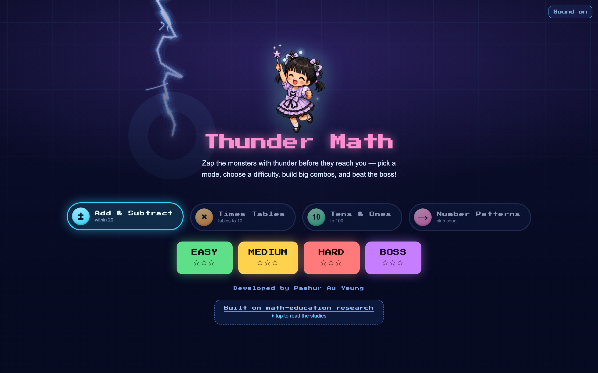
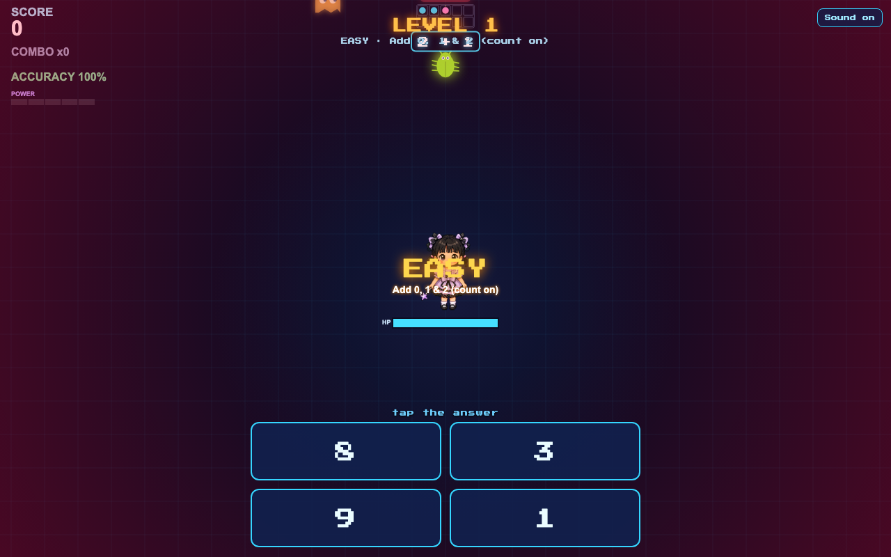
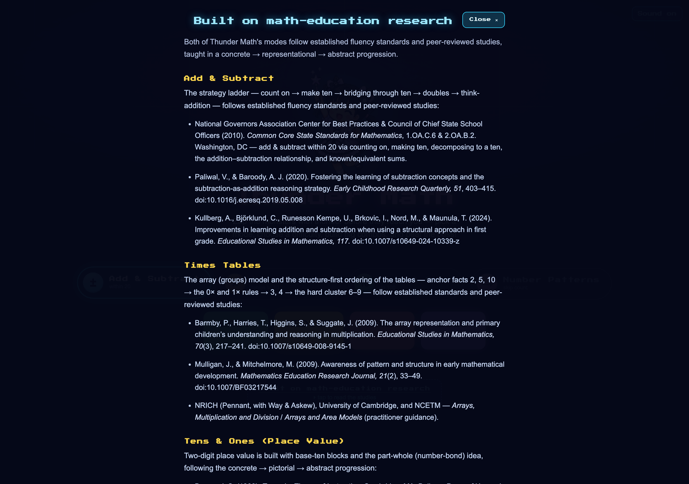

# ⚡ Thunder Math

**Zap the monsters with thunder before they reach you** — pick a mode, choose a difficulty, build big combos, and beat the boss!

Thunder Math is a fast, arcade-style math practice game for kids, rendered in **3D with three.js (WebGL)**. Every monster carries a question; tap the right answer to strike it down with lightning before it reaches the hero. The whole game is a **single HTML file** — no build step, no accounts, no data collected — and it's **designed for mobile screens** as well as desktop.

🎮 **[Play it now »](https://pasuay.github.io/thunder-math/)**



---

## ✨ Features

- **Four practice modes**
  - ➕ **Add & Subtract** — within 20
  - ✖️ **Times Tables** — tables to 12
  - 🔟 **Tens & Ones** — place value to 100
  - ➡️ **Number Patterns** — skip counting
- **Four difficulty tiers** — Easy, Medium, Hard, and a **Boss** fight
- **Combo system & scoring** — answer fast and accurately to build big combos and earn up to ⭐⭐⭐ per level
- **Built on math-education research** — the difficulty ladder in each mode follows established fluency standards and peer-reviewed studies (count on → make ten → bridging → doubles, the array model for multiplication, base-ten blocks for place value, and more)
- **3D graphics in the browser** — built with **three.js / WebGL** for the scene and effects, with a 2D canvas HUD overlay
- **Mobile-screen compatible** — responsive layout, large touch-friendly tap targets, and a locked viewport so it plays great on phones and tablets (touch and mouse both supported)
- **Zero install** — a single HTML file; just open it or host it anywhere static

## 🕹️ How to play

1. Pick a **mode** (Add & Subtract, Times Tables, Tens & Ones, or Number Patterns).
2. Choose a **difficulty** — or jump straight into a **Boss** battle.
3. Monsters drift toward your hero, each showing a math problem.
4. **Tap the correct answer** to zap the highlighted monster with thunder.
5. Keep your hero's health up, build your combo, clear the stages, and defeat the boss!

| Gameplay | Research-backed design |
|---|---|
|  |  |

## 🛠️ Built with

- **HTML5** — a single `index.html` file, no build tooling
- **[three.js](https://threejs.org/) (r128) over WebGL** — `WebGLRenderer` + `PerspectiveCamera` for the 3D scene, loaded from a CDN
- **2D Canvas** — HUD and on-screen effects overlay
- **Web Audio API** — sound effects and music

> Note: three.js is loaded from a CDN, so an internet connection is needed the first time it runs.

## 🚀 Run it locally

No build step required. Either:

- **Open directly** — double-click `index.html` to open it in your browser, **or**
- **Serve it** (recommended for full audio support):

  ```bash
  # Python 3
  python3 -m http.server 8000
  # then visit http://localhost:8000
  ```

## 🌐 Hosting on GitHub Pages

This repo is ready for free hosting:

1. Go to **Settings → Pages**.
2. Under **Build and deployment**, set **Source** to *Deploy from a branch*.
3. Choose branch **`main`** and folder **`/ (root)`**, then **Save**.
4. After a minute the game is live at `https://pasuay.github.io/thunder-math/`.

## 📚 Built on math-education research

Each mode's progression mirrors established fluency standards (e.g. the Common Core State Standards for Mathematics) and peer-reviewed research in early mathematics education — moving deliberately from concrete → pictorial → abstract. Open the **"Built on math-education research"** panel on the start screen to read the full citation list inside the game.

## 🙌 Credits

Developed by **Victoria AY's Daddy**.

## 📄 License

All rights reserved unless a license file is added. Feel free to play and share the link!
